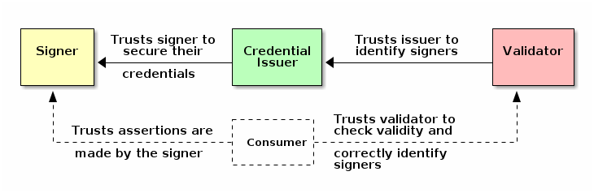

# Zero Trust Comparisons
One of the most frequently asked questions relates C2PA to SEAL: What does SEAL provide that C2PA does not?

C2PA is an institutional trust framework anchored in X.509 and curated trust lists. As diagrammed in the [C2PA Specifications](https://spec.c2pa.org/specifications/specifications/2.3/specs/C2PA_Specification.html#_trust_model):

- **Certificates**: The signer uses a certificate tied to a curated "trust list" (TL). The validation process is opaque and cannot be verified by the end user. The certificates contain a text name that identifies the certificate owner, but there is no information for cross-validating the attribution.
- **Secured Credentials**: The credential issuer trusts the signer to secure their credentials.
- **Assertions**: C2PA offers two types of assertions. *Gathered assertions* contain data from unvetted sources, such as GPS locations or camera settings, and are explicitly untrusted. *Created assertions* come from trusted services. However, if you do not trust the signer, then the created assertion remains untrusted. The consumer trusts that the assertions made by the signer are valid.
- **Validation**: The consumer trusts the validator to check the validity and correctly identify signers. As of February 2026, the three main validation methods [c2patool](https://github.com/contentauth/c2pa-rs), Adobe's [Inspect](https://contentauthenticity.adobe.com/inspect), and CAI's [Verify](https://verify.contentauthenticity.org/) often return different and conflicting results for the same media.
- **Validators**: The validators check the signature against the TL without cross-validating the named certificate owner.
- **Conformance**: As of C2PA 2.3 (2026), the conformance program only compares paperwork that describes the implementation against the specification. If the documentation matches, then the product *conforms*. With C2PA, "Level 1" conformance (lowest) and "Level 2" (highest) are strictly a self-affirmation. There are no test vectors or third-party test procedures for independent validation.
- **Rot**: C2PA has had public demonstrations and examples dating back to 2021. Most of the earlier examples, including ones from 2025, cannot be validated using the common tools in 2026. This is due to changing validator policies, deprecated CA roots, and evolving interpretations of the specification. In effect, previously verifiable media may rot and become unverifiable.
- **Adversarial Interoperability:** C2PA requires all parties to "opt-in" to a centralized trust model. (Well, technically C2PA can operate without a vendor trust list (*untrusted signing mode*), but this breaks most real-world workflows, and validators are not required to show the identity when the TL is bypassed.) If a single link in the chain (the CA, the software vendor, or the trust list manager) fails or changes their policy, the entire chain of custody for your media can be retroactively invalidated.

In contrast:
- **Forensically Admissible:** SEAL is a forensically-sound notary service with infrastructure autonomy. SEAL signatures are deterministic and do not rely on external policy or certificate validity periods. As long as you own your domain, your proof remains valid, regardless of corporate policy shifts.
- **Test Suite:** The [SEAL-C](https://github.com/hackerfactor/SEAL-C) implementation contains a regression test suite. Any implementation that can generate compatible signatures and validate the test suite signatures is compliant.
- **Long-term Validation:** Files signed by SEAL in 2024 (when SEAL was first released) are still verifiable today. Because SEAL uses stable DNS records, stable public keys, and a non-changing binary signature format, there is no *rot* equivalent for SEAL.

## Zero Trust Comparison Table
|**$${\color{blue}Zero Trust Principle (NIST 800-207 / CISA)}$$**|**$${\color{blue}C2PA 'Institutional' Implementation}$$**|**$${\color{blue}SEAL 'Notary' Implementation}$$**|
|---|---|---|
|**Verify Explicitly (Always Verify)**|**Fails:** Relies on pre-trusted "Allow Lists" managed by vendors. If the CA is on the list, then the manifest is accepted without dynamic validation.|**Meets:** Verification is tied to real-time DNS records. The validator must explicitly fetch the signer's public key from the source's infrastructure to succeed.|
|**Least Privilege**|**Fails:** Once a signer is trusted, they have broad "privilege" to sign any assertion (GPS, AI-edit, Date). There is no granular policy to limit what they can sign.|**Meets:** Restricted to a "notary" role. It only signs the current state of data. SEAL makes no claims about the internal history of the file, minimizing the privilege of the signer.|
|**Assume Breach**|**Fails:** C2PA assumes the signing server/certificate is uncompromised. A single stolen key can validate an infinite amount of forged content until an (often ignored) CRL is updated.|**Meets:** Assumes the environment is hostile. Revocation is near-instant by updating a DNS TXT record (low TTL). Compromise is localized to the domain's current infrastructure state.|
|**Continuous Monitoring / Validation**|**Fails:** Manifests are static. Once signed, the trust is locked into a certificate that may expire or rot, leading to "temporal decay" where files become unverifiable.|**Meets:** Validation is dynamic. Because SEAL checks DNS, the attribution remains valid as long as the domain owner maintains their public record, regardless of when the file was signed.|
|**Microsegmentation**|**Fails:** The manifest is a monolithic block. If you trust the signature, you are forced to trust every individual assertion inside it as a single "unit" of trust. For the cryptography, C2PA assumes that trust is transitive: the user trusts Adobe, Adobe trust the CA, the CA trusts the signer, etc. This creates a long chain of implicit trust. NIST 800-207 requires that trust be "dynamic and temporary," while C2PA's trust is static and indefinite.|**Meets:** Data-centric approach. SEAL signs the hash of the file itself. It doesn't bundle unverified side-data, ensuring the "trust boundary" is strictly defined by the content's integrity. SEAL's trusted PKI is direct, with the public key verified as coming from the named domain. With SEAL, the PKI trust boundary is the domain itself.|
|**Complexity (Attack Surface)**|**High Risk:** Hundreds of megabytes of dependencies (JUMBF, CBOR, X.509). The large codebase creates a massive attack surface for parser exploits.|**Low Risk:** Minimalist footprint (<1KB signatures). Uses standard, battle-tested EdDSA/RSA encryption with proven DKIM approach provides a tiny attack surface for implementation errors.|
|**Device Security**|**Fails:** C2PA Often treats the "signer" as a generic corporate entity (e.g., "Signed by Adobe"). It lacks granular ties to the specific hardware health or device posture at the moment of capture.|**Partial:** Designed to be hardware-agnostic and lightweight. Because it anchors to DNS, it can be integrated into the device's unique identity (DID) or TPM more easily without heavy CA overhead. However, SEAL does not verify the health of the signing device (e.g., *Is the OS patched?*).|
|**Data Protection**|**Weak:** Focuses on integrity (*did it change?*) rather than protection (*who can see it?*). C2PA manifests are often public and unencrypted, potentially leaking metadata like GPS or serial numbers.|**Stronger:** Focuses on minimalist notarization. SEAL protects the data by providing a tamper-proof hash without requiring a massive, leaky metadata payload that could be exploited.|
|**Encrypt Everything**|**Fails:** C2PA is not designed for confidentially. Manifests are generally plaintext JUMBF structures. While the signature is cryptographic, the data assertions inside are readable by anyone with a parser.|**Partial:** SEAL signatures are purely cryptographic blobs. It's an attribution tag, not a privacy wrapper.|
|**Comprehensive Telemetry**|**Partial:** Validation is often a "silent" local process with telemetry as an unintentional byproduct from the complexity. C2PA has hooks for callbacks that can enable centralized tracking of media. These callbacks include trusted list refresh requests, CRL lookups, and remote sidecar retrieval. C2PA can be used for tracking media and validators.  However, in a Zero Trust Architecture (ZTA) no action (especially an outbound network request) should occur before the requestor is authenticated and authorized. With C2PA, Most implementations parse the manifest and trigger "sidecar" fetches (or potential CRL information) *before* the cryptographic integrity of the manifest is fully established. As a result, an attacker can craft a "Malicious Manifest" that points to a target URL. This turns the hostile manifest into a Distributed Reflective Denial of Service (DRDoS) engine. Moreover, an attacker can trigger a C2PA callback without a valid signature. The malicious user can flood a government or corporate telemetry server with millions of fake "validation" events. This violates the Comprehensive Telemetry principle because the data being collected is not high-fidelity; it becomes noise that masks actual breach attempts.|**None:** Every validation requires a DNS lookup. However, DNS uses relays and caching; the authoritative DNS provider does not receive any logs related to validation. While this fails ZT, it enables privacy because the media can be validated without tracking.|
|**Automation**|**Difficult:** Due to its 16MB+ footprint and complex dependency tree (CBOR, JSON, X.509), C2PA is hard to automate in edge or serverless environments without significant overhead. Revocation is a manual process that may take days or weeks to propagate.|**Native:** Extremely high automation potential. Since SEAL uses standard DNS and simple CLI tools, it can be integrated into CI/CD pipelines, auto-scaling web servers, and IoT devices with zero friction.|

SEAL's biggest limitation is the reliance on the integrity of the DNS system. If an attacker hijacks a domain's DNS, they can issue "valid" SEAL signatures. However, these are considered to be "low risk":
- NIST 800-207 generally accepts DNSSEC and similar controls as a standard part of the environment, making this a known and manageable risk compared to the "Black Box" of C2PA trust lists.
- A domain hijacker must create their own signing keys since the private keys are not stored in DNS. A hijacker cannot sign files using the true-owner's keys. When a hijacked domain is recovered, the hijacker's keys can be readily revoked, undoing any damaged.

Forensic Admissibility Note: Because C2PA implementations (e.g., Adobe Inspect, CAI Verify, c2patool) can produce conflicting results for the same file, C2PA currently lacks the "reproducibility" required for use in a court of law. SEAL's reliance on a *Regression Test Suite* ensures that any compliant validator will reach the exact same conclusion, making it a more stable "digital evidence" standard.

## The "Trust Anchor" Divergence
The core reason C2PA struggles with Zero Trust is its Trust Anchor.

- C2PA uses a "Black Box" Trust List. To be "Verified," you must be on a list curated by companies like Adobe or Microsoft. This is a centralized, "Trusted Third Party" model that ZT aims to eliminate.

- SEAL uses Infrastructure as Identity. It treats the domain owner's DNS record as the source of truth. If you trust that nytimes.com is owned by the New York Times, you can trust their SEAL signature without needing a middleman CA to "vouch" for them.

It should be noted that C2PA never claims to be zero-trust compliant. Although the C2PA specifications describe it as a security solution (see: the C2PA specifications, section [17. Information Security](https://spec.c2pa.org/specifications/specifications/2.3/specs/C2PA_Specification.html#_information_security)), its threat model is inherently *location-centric* (relying on the security of the signing server or device) rather than *identity/context-centric* (e.g., verifying the signer's identity through independently retrievable infrastructure signals, such as domain ownership).

While C2PA attempts to build a *Circle of Trust* among institutions, SEAL builds a *Web of Verification* among infrastructure. For organizations migrating to a Zero Trust Architecture, the latter is a requirement and not just a preference.
